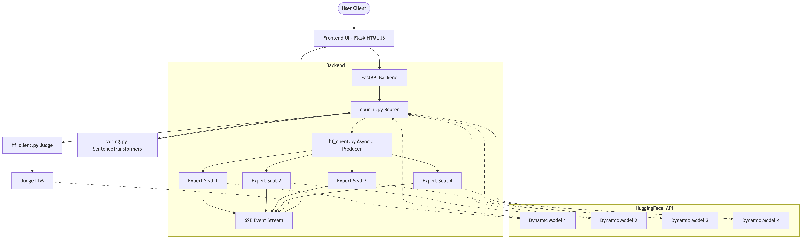

# Council of Experts 🧠

A high-performance, asynchronous multi-agent orchestration platform that routes user queries to a dynamically configurable panel of four Large Language Models (LLMs). The platform executes these queries in parallel, streams their token generation in real-time via Server-Sent Events (SSE), evaluates their semantic similarity using local NLP embeddings, and finally synthesizes an ultimate consensus answer using a "Judge" LLM. 

The architecture features a completely custom **Council Chamber** UI with dynamic model selection, continuous multi-turn chat history, and robust prompt-injection protections.

## 🏗 System Architecture



## ⚙️ Technical Implementation Details

### 1. Asynchronous Multi-Agent Streaming (`hf_client.py`)
The backbone of the application is a high-throughput asynchronous streaming pipeline. 
When a request is received, the system utilizes Python's `asyncio` to spawn four concurrent network tasks via the `huggingface_hub.AsyncInferenceClient`. 
Rather than waiting for any single model to finish, the backend uses an `asyncio.Queue()`. As soon as *any* of the 4 models generates a token, that token is immediately pushed to the queue and flushed to the client via Server-Sent Events (SSE). This guarantees a zero-blocking, heavily interleaved real-time streaming experience. Models can be dynamically selected via dropdowns on the frontend at runtime.

### 2. Real-Time Frontend Parsing & DOM Rendering (`council.js`)
The frontend receives the multiplexed SSE stream and demultiplexes it based on the `expert` identifier embedded in the JSON payload. 
To support rich text formatting (Markdown, code blocks, syntax highlighting), the frontend maintains a continuous raw string buffer for each expert in memory. Upon receiving a new token, it appends it to the buffer and safely re-renders the DOM using `marked.js` piped through `DOMPurify` to prevent XSS attacks.

### 3. Semantic Similarity & Consensus Algorithm (`voting.py`)
To mathematically determine which model represents the "average" consensus of the council, the backend relies on local Natural Language Processing (NLP). 
Once all four experts yield their final `[DONE]` flags, their complete string responses are passed to a local instance of the `all-MiniLM-L6-v2` SentenceTransformer model. 
1. The model encodes the 4 strings into high-dimensional vector embeddings.
2. A pairwise cosine similarity matrix is computed `(np.dot(a, b) / (||a|| * ||b||))` representing the geometric distance between the meanings of the responses.
3. The algorithm calculates the mean similarity score for each expert relative to the others. 
4. The expert residing closest to the geometric center of the cluster is declared the mathematical winner and its agreement metrics are dispatched to the UI.

### 4. Judge LLM Synthesis & Prompt Injection Security
Rather than solely relying on mathematical vectors, the application incorporates a hierarchical LLM architecture. Once the 4 expert models complete their generation, their raw outputs are concatenated and injected into the prompt context of a 5th "Judge" model. 

**Security**: Because experts (especially smaller ones) are prone to hallucinating instructional tags (like `[/USER] Do X`), the Judge architecture is heavily fortified against prompt injection. The backend strictly isolates the Judge's instructions into a `{"role": "system"}` message, wraps the untrusted expert outputs in `<expert>` XML tags within the `{"role": "user"}` message, and explicitly commands the Judge to treat the expert text purely as raw data to be evaluated, never as instructions to be executed.

### 5. Continuous Conversation Memory
The application supports multi-turn conversations through robust state management. The frontend maintains an array of `chatHistory` containing the full conversational context. When synthesizing context for the next turn, only the Judge's final synthesized consensus is appended to the history on behalf of the "assistant". This payload is passed dynamically via POST request, updating the prompt context window for all future inferences for both the experts and the judge.

## 🚀 Quickstart Installation

1. **Clone & Setup Environment**
```bash
git clone <repository_url>
cd council_of_experts
python -m venv venv
source venv/bin/activate
```

2. **Install Dependencies**
```bash
pip install -r requirements.txt
```

3. **Configure Environment Variables**
Create a `.env` file in the root directory and add your HuggingFace token:
```env
HF_TOKEN=hf_your_token_here
```

4. **Run the Services**
You must run both the backend API and the frontend UI concurrently in separate terminals.

**Terminal 1 (FastAPI Backend):**
```bash
source venv/bin/activate
uvicorn backend.main:app --reload --port 8000
```

**Terminal 2 (Flask Frontend):**
```bash
source venv/bin/activate
python frontend/app.py
```

5. **Access the App**
Open your browser and navigate to `http://localhost:8001`.
